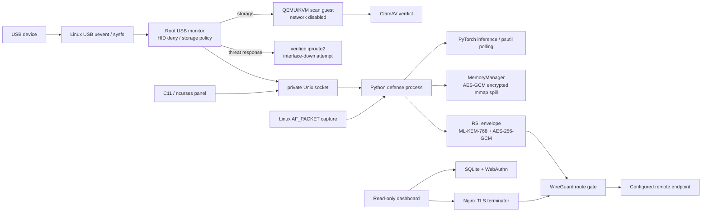

# MK1Ai 技術セキュリティ監査レポート

**審査日:** 2026-10-09  
**対象:** MK1Ai リポジトリのソース、README、依存宣言、およびUSBガードの変更差分  
**方式:** 静的コード確認と `tests/test_usb_guard.py` の実行。独立認証、形式検証、実機侵入試験は実施していない。

> **結論:** 本レポートは実装経路を限定的に確認した技術レビューであり、Common Criteria認証、規制プロファイル適合、形式検証または独立認証の証拠ではない。暗号実装はML-KEM-768、Ed25519等を用途別に使用しており、特定の承認済みアルゴリズム集合との全体適合は確認していない。形式仕様・定理証明の成果物、物理破壊連動の送信・破壊機能は存在しない。

## 1. エグゼクティブ・サマリー

| 項目 | 判定 |
|---|---|
| 評価範囲 | 静的確認と明記した単体テストの限定的レビュー。製品認証・第三者評価なし |
| 形式的保証 | 形式仕様、モデル検査、定理証明、証明済みビルド成果物なし |
| 暗号プロファイル適合 | **未評価 / 確認できず**。ML-KEM-768等を使用し、用途・provider・外部TLS設定は個別に確認が必要 |
| HID対応 | 変更済み。ホットプラグ処理で認識したUSB HIDは登録状態に依存せず拒絶を試行。許可リスト・登録CLIを撤去 |
| 秘密消去 | C/OpenSSL `OPENSSL_cleanse` とLinux libc `explicit_bzero` によるバッファ消去を確認。全コピーの不可逆消去・原子性は証明されない |
| 破壊連動動作 | 破壊検知、破壊に連動する送信・破壊動作は実装していない |

**変更点:** `mk1_usb_guard.py` のHID許可リスト判定・登録処理・`enroll-hid` CLIを削除し、HIDを一律拒絶する方針に統一した。テストとREADMEも追従済み。USBガードの14テストは成功した。これはUSBイベント処理の単体テストであり、全OS・全コントローラーでの物理遮断を証明しない。

## 2. システム構成と防衛シーケンス



**処理の要点:** Linux上で起動したUSBワーカーはueventを受け取り、デバイス情報をsysfsから読み込む。ハブを除き、HIDはsysfs unbindを試す。ストレージはホスト側のドライバーを外し、ネットワーク無効の一時QEMUゲストでスキャンする設計。脅威判定時はIPC経由の鍵破棄要求とiproute2によるNIC停止を試みる。別経路ではPythonがAF_PACKETを使ったパケット観測やAI推論を行い、RSI通信時はWireGuard経路を確認し、アプリケーション層のPQC/AES-GCM envelopeを利用する。

uevent監視とsysfs unbindは非同期の論理隔離であり、デバイスが最初にenumerateされること、先行入力、unbind失敗、監視が起動していないモードを排除する証拠ではない。図は実装構成の概略で、全経路が常時起動することを意味しない。

## 3. 主な技術・ライブラリ・機能

この表はソースと文書で確認できた主要構成要素であり、依存パッケージ・OS機能の完全なSBOMではない。各機能の有効性は設定・OS・導入依存に左右される。

| 技術・機能 | 実際の役割 | やさしい説明 |
|---|---|---|
| C11 | ローカルncursesパネル、暗号トンネル補助、メモリガード | 機械に近い言葉で、小さく速い操作部分を書く道具 |
| ncurses | 端末上のメニューと状態表示 | 文字だけの画面にボタンや一覧を並べる道具 |
| OpenSSL EVP / `OPENSSL_cleanse` | C側AES-256-GCM等と秘密バッファのゼロ化 | 暗号の道具箱と、使い終わった紙を消す処理 |
| `cryptography` | Python AES-GCM、HKDF等 | Pythonから暗号機能を使うための道具箱 |
| `pqcrypto` ML-KEM-768 | RSIアプリ層の鍵カプセル化 | 相手だけが開ける鍵付きの小包を作る。現行は1024ではない |
| liboqs | 任意のC側ML-KEM-768 provider | 追加の暗号実装。導入されていない環境ではC providerを使えない |
| ML-DSA-87 | **実装を確認できない** | 将来必要な量子耐性署名方式。現在の署名として説明してはならない |
| AES-256-GCM | RSI payloadとメモリ退避データの暗号化など | 中身を読めなくし、途中で書き換えられたことも見つける封筒 |
| HKDF / SHA-256 | RSI共有秘密からAES鍵を導出 | 元の秘密から用途に合う鍵を作るレシピ。全経路がSHA-384/512ではない |
| TLS 1.3 / Nginx | WireGuard bind上のダッシュボードHTTPS終端。設定テンプレートはAES-256-GCM-SHA384とX25519MLKEM768を指定 | ブラウザーとサーバー間の封筒。実際の暗号は導入したNginx/OpenSSL設定に依存 |
| WireGuard | 外側のVPN経路とルート確認 | 通信を専用トンネルに通す。標準暗号はCurve25519とChaCha20-Poly1305で、AES/PQCへの置換ではない |
| Linux AF_PACKET | Pythonのユーザー空間パケット観測 | ネットワークカードから届く荷物をOS経由で観察する窓口 |
| eBPF / libbpf | 実際のパケット防衛経路としては未実装。libbpfは任意ライブラリのAPI存在確認のみ | カーネル内で安全に小さな処理を動かす仕組み。ここでは防衛フィルターとして動いていない |
| PyTorch | AIモデルの推論・学習関連 | 例を見て分類する計算機 |
| psutil | プロセス・メモリ等の定期監視 | コンピューターの状態計を読む道具 |
| QEMU/KVM | USBストレージを渡す一時スキャンゲスト | 本体と別の使い捨て作業机を作る仕組み |
| ClamAV | USBスキャンゲスト内のマルウェア検査 | 既知の危険ファイルを探す検査員。未知脅威の不存在は証明しない |
| Ed25519 | USBスキャンゲストの署名検証経路として文書化 | 署名者を確認する印鑑。ML-DSA-87ではない |
| SQLite | リモートダッシュボードのローカル認証・状態データ | 小さな帳簿。ネットワーク型データベースではない |
| WebAuthn / Passkey | ダッシュボードの登録・ログイン認証 | Webサイトと端末が公開鍵を使って本人確認する仕組み。生体認証だけを強制しない |
| Gmail SMTP / Twilio SMS | 設定された場合の追加OTP配送 | メールやSMSで一時コードを届ける。通信事業者以降の保護は別管理 |
| libc `explicit_bzero` | Python可変bytearrayに対応するnative wipe処理 | 最適化で消去が消えないよう、指定したメモリ範囲を上書きする |
| libsodium `sodium_memzero` | テストランナーの任意ライブラリ機能検出・テスト | テスト対象の消去関数。本体の全秘密を消す共通経路ではない |
| `capset` v3 ABI | Linux capability集合を操作する権限降格用コード | 管理者の鍵束から不要な鍵を外す仕組み。実行条件と実機状態の監査が必要 |
| mmap / AES-GCM MemoryManager | RAM退避データを暗号化し一時ファイルに書く | 机からあふれた紙を鍵付き引き出しへ移す。破壊証拠保管庫ではない |
| uevent / sysfs unbind / iproute2 | USB接続通知、論理切断、NIC停止操作 | OSへ機器や通信を止めるよう依頼する手段。物理スイッチではない |
| Google Colab / Drive / cloudflared | 任意の学習・RSI連携で外部サービスを利用 | 遠隔の計算機・ファイル置き場・接続中継。サービス側TLSはMK1Aiから固定できない |

## 4. 審査所見と技術的根拠

### USB HID拒絶

変更後の制御フローでは、識別済みデバイスについてハブ判定の後に `device.is_hid` を評価し、VID/PID/シリアルの許可リスト参照なしで `_unbind()` を呼ぶ。以前存在したHID許可リストと登録CLIは削除した。単体テストでは許可登録状態に依存しない拒絶、シリアルなしHID、複合interfaceを確認する。

**限定:** `is_hid` はsysfs descriptor情報に基づく。イベント到着前の入力を止めず、unbind成功を保証しない。ホットプラグ監視が動作するモードに限定され、OS全体の全入力経路や暗号学的認証済み機器の例外受付は実現していない。

### メモリ保護・消去

C側はOpenSSL `OPENSSL_cleanse`、Python側native helperはlibc `explicit_bzero` を用い、Python transportは可変セッション鍵バッファを破棄する。Linuxメモリガードにはdump抑止、`mlock`、`MADV_DONTDUMP`、TracerPid監視がある。TracerPid監視間隔は100 msであり、保証遅延ではない。

これらは対象バッファの消去・保護措置である。Python immutable bytes、暗号ライブラリ内部コピー、allocator、CPU cache、swap、ストレージ媒体、カーネル内WireGuard鍵を含む全コピーの消滅を証明しない。「atomic wipe」またはシステム全体の不可逆消去という性質は立証されていない。`sodium_memzero` はテストランナーの任意依存検査であり、アプリ全体の消去経路を構成しない。

### 最小権限

ソースにはLinux capability v3 ABIを利用する `capset` 処理がある。存在する関数だけでは、全実行モードで必ず最小権限になること、capability bounding set・ambient set・名前空間・ファイル権限まで含む完全な権限分離は証明できない。実行ユーザー、保持capability、呼び出し時点を配備ごとに検証する必要がある。

### オフライン・送信・形式保証

オフライン時のRSI送信はWireGuardルートとendpointに依存する。MemoryManagerにはランダム鍵をプロセス内に置くAES-GCM mmap退避処理があるが、再起動後も復元可能な証拠保管庫や改ざん耐性のある監査ログとは確認できない。ネットワーク復帰時の証拠一括送出、物理破壊連動処理、破壊動作は実装されていない。

コード上のHID分岐について「識別済みHIDならunbindを要求する」という制御フロー上の性質はテスト可能である。しかし、ハードウェア・カーネル・割込み・物理タイミングを含めた数学的定理ではない。形式仕様、証明器による証明、証明済みコンパイラ出力、独立第三者監査の証跡がないため、形式適合を宣言しない。

## 5. 暗号構成と適合性の確認範囲

| 暗号用途 | リポジトリで確認したもの | 判定 | 差分・注意 |
|---|---|---|---|
| 鍵交換: ML-KEM-1024 | Python・C・Colab連携はML-KEM-768を参照 | **不適合** | 全endpoint・テスト・C provider・ノートブックを含む互換移行が必要 |
| デジタル署名: ML-DSA-87 | USBゲストmanifest署名はEd25519。ML-DSA-87実装は未確認 | **不適合** | 署名鍵形式、検証provider、配布・ローテーションまで設計が必要 |
| 対称暗号: AES-256-GCM | RSI envelope、C tunnel補助、MemoryManagerの一部 | **部分的** | すべてのTLS/外部事業者/保存先が同じアプリ制御とは限らない |
| ハッシュ・MAC: SHA-384 / SHA-512 | Nginx TLS suiteにSHA-384。複数のアプリ機能はSHA-256/HKDF-SHA256 | **部分的** | SHA-512の全層使用や統一的CNSA policyは確認できない |
| WireGuard + PQC hybrid | WireGuard外側と別のRSI ML-KEM-768 envelope。TLSテンプレートはX25519MLKEM768 | **不適合** | WireGuard自体の標準暗号はCurve25519/ChaCha20-Poly1305。外側をML-KEM-1024にしたとはいえない |
| 外部プロファイルへの適合 | 用途の異なる方式が混在 | **未評価** | 外部Google・SMTP・SMS通信の暗号suiteはアプリから全面指定できない |

適合性の判定には対象プロファイル、承認provider、実装、プロトコル、鍵管理、運用および認証証跡の評価が必要であり、本表は適合判定や暗号モジュール検証の代替ではない。

## 6. 物理破壊・オフライン生存に関する検証

| 想定機能 | 確認結果 |
|---|---|
| ネット切断中のローカル保存 | MemoryManagerの一時暗号化mmap退避は存在する。暗号鍵はプロセス内ランダム鍵で、永続的なブラックボックス証拠保管を示さない |
| オンライン復帰後の証拠一括送信 | そのようなqueue・再送回路を確認できない |
| 物理破砕/ドリル/爆破の検知 | センサー・トリガー回路を確認できない |
| 破壊直前のPQC/AES/WireGuard送信 | 実装されていない。秘密裏の証拠送信を追加しない |
| 物理破壊に連動する動作 | 実装されていない。破壊や自動報復動作は対象外 |
| 物理・ソフトウェア境界の保証 | 確認されていない。USB sysfs unbindは論理操作で、実機ハードウェア検証が必要 |

**最終判定:** MK1Aiは実験用防御ソフトウェアである。認証、規制暗号プロファイル適合、形式証明、オフライン永続性、物理防護を裏付ける証拠はない。HIDポリシーはLinux uevent監視が稼働する条件下で識別済みUSB HIDのsysfs unbindを試みる機能として評価する。

## 7. 使い捨てVMでのテスト証跡

テストはワークスペースコンテナ内のQEMU/KVMで起動した使い捨てゲスト内で実施した。ホストOSのNIC設定、実ネットワーク経路、実USB機器、外部サービスには変更・接続していない。API token、秘密鍵、本番データはゲストへ持ち込んでいない。

| 項目 | 記録 |
|---|---|
| ハイパーバイザー | QEMU 8.2.2、KVMアクセラレーション。QEMU起動はユーザー許可後に実施 |
| ゲスト | Ubuntu 24.04.5 LTS、Python 3.12.3 |
| VM構成 | 2 vCPU、1.5 GiB RAM、24 GiB qcow2 |
| NIC | virtio NIC 1個。通常時はQEMU user-mode NAT (`10.0.2.0/24`)、ブリッジなし。SSH転送はホストloopbackの `127.0.0.1:41222` のみ |
| 共有経路 | 共有フォルダー、クリップボード、USB passthroughなし。ソースISOには `.git`、実データ、認証情報を含めていない |
| スナップショット | `mk1ai-pre-nic-isolation`。qcow2を正常停止した状態で作成し、その後のNIC遮断試験の復元点に使用 |
| 依存環境 | ゲスト内に依存なし `.venv-baseline`、暗号/HTTP依存 `.venv-core`、CPU Torch追加 `.venv-torch` を分離して作成 |
| 主なテスト依存 | `cryptography 50.0.2`、`pqcrypto 1.0.0`、`requests 2.34.2`、`torch 2.14.1+cpu`、`numpy 2.5.3` |

テスト用依存はゲストvenvにのみ導入した。暗号機能の直接依存として `cryptography` を `requirements-secure-transport.txt` に追加し、テストは実Torchがないstub環境を実Torch相当と誤認しないよう依存条件を明示した。

| 環境・コマンド | 結果 | 分類 |
|---|---:|---|
| 初回 `.venv-baseline`: `python -m unittest discover -s tests -p 'test_airgap_ai_defender.py' -q` | 126件中5失敗・15エラー | 依存なし時の既存失敗を再現。Torch stubのAPI不足、optional暗号/transport/HTTP依存不足、およびAES-GCM無効時の暗号化退避テストが原因 |
| 初回 `.venv-core`（Torchなし）で同防衛テスト | 126件中6失敗・3エラー | 実Torchを要するモデル・学習・checkpointテストがTorch stub上で失敗 |
| 修正後 `.venv-baseline` で同防衛テスト | 126件 `OK`、20件skip | 依存固有テストを明示skip。残る106件は成功 |
| 修正後 `.venv-baseline`: `python -m unittest discover -s tests -p 'test_secure_transport.py' -q` | 13件すべてskip | `cryptography` / `pqcrypto` がない場合の明示skipを確認 |
| 修正後 `.venv-core` で防衛テスト | 126件 `OK`、9件skip | Torch依存ケースだけskip。残る117件は成功 |
| 修正後 `.venv-core` でsecure transportテスト | 13件 `OK` | ML-KEM-768/AES-GCM等のテスト依存あり |
| `.venv-torch` で防衛テスト | 126件 `OK` | 実CPU Torchを使用 |
| `python -m unittest discover -s tests -p 'test_usb_guard.py' -v` | 14件 `OK` | mockを用いた単体テスト。実USB機器への試験ではない |
| `make check` | 成功 | OpenSSL 3.0.13、libsodium、libbpf、ptrace制限等を確認。liboqs未導入のためliboqs検査とC ML-KEM往復試験はskip |

**NIC遮断中の確認:** スナップショット起動後、ゲスト内で合成JSONL 2件を使うREADME記載のvalidation-only学習Dry-Runをsystemd timerで予約し、QMP `set_link nic0 off` でゲストのvirtio NICだけを切断した。切断中はSSHがtimeoutし、ホスト転送を通じたゲスト到達性が失われた。ホスト側NICやブリッジ設定は変更せず、他VMへの経路操作も行っていない。リンクを戻した後にゲストの結果を回収した。

再現に使った主要コマンドとQMP要求:

```text
qemu-img snapshot -c mk1ai-pre-nic-isolation /tmp/mk1ai-qemu-20261009/ubuntu-noble.qcow2
{"execute":"set_link","arguments":{"name":"nic0","up":false}}

# Guest, while the timer-run validation executes:
.venv-torch/bin/python airgap_ai_defender.py \
  --config test-results/offline-validation/no-config.json \
  --mode normal --drive-id "" \
  --local-dir test-results/offline-validation/normal \
  --validation-only --max-samples 2
.venv-torch/bin/python -m unittest discover \
  -s tests -p test_airgap_ai_defender.py -q

{"execute":"set_link","arguments":{"name":"nic0","up":true}}
```

- Dry-Run終了コード `0`。ログはローカルデータを選びDrive取得をskipしたこと、2件のHead B学習完了、ローカルcheckpoint保存を示した。
- 同じNIC遮断中に `test_airgap_ai_defender.py` 全126件を再実行し、`OK`。テスト内の外部transportはmockされており、秘密や実データは使っていない。
- 生成checkpointはmode `0600`。付随SHA-256 sidecarとファイルから再計算したハッシュが一致した。モデルを再ロードするローカル学習/checkpointテストとhash不一致拒否テストも同suite内で成功した。これはローカル完全性確認であり、署名者の真正性や遠隔同期成功を意味しない。
- MemoryManagerの暗号化mmap循環退避テストはAES-GCMが利用可能な `.venv-torch` で成功。AES-GCMがない環境では退避を無効化し、該当する暗号化退避テストをskipする。

**未検証:** ゲスト内の非特権ユーザーではAF_PACKET raw socket作成が `EPERM` となった。CAP_NET_RAWを持つ実アプリ実行条件でのpacket captureは実施していない。ゲストにはnested QEMUと `clamscan` がなく、QEMU/KVM USB passthrough、ClamAV、sysfs unbindの実デバイス動作は未検証。USBテストのunbind/ueventやゲストscanはmockであり、物理遮断を裏付けない。Colab/Drive/RSIへの実通信も実施していない。

VM内のテストログは `/opt/mk1ai/test-results/` に保存した。qcow2、スナップショット、ログは作業用コンテナの `/tmp/mk1ai-qemu-20261009/` にあり、Git成果物には含めていない。これらはワークスペース外の永続的な証拠保管ではない。

## 8. 依存・実行機能の棚卸し

| 区分 | 構成 | この検証での扱い |
|---|---|---|
| Python標準ライブラリ | socket、ssl、sqlite3、threading、subprocess等 | ローカルコード経路と単体テストで使用 |
| optional Python runtime | PyTorch / NumPy、psutil、requests、gdown | Torchなし/ありを分けた。Drive/HTTPテストは必要依存がない場合にskipし、stubを本物のモデル実行として扱わない |
| secure transport | `cryptography`、`pqcrypto` ML-KEM-768 | requirementsに宣言。依存ありで13テスト、依存なしで13 skip |
| native / OS機能 | OpenSSL、C compiler、libbpf、libsodium、Linux capability、AF_PACKET | `make check`の範囲は通過。ただしlibbpfは機能検出であり、eBPF datapathは未実装。AF_PACKET実captureは未検証 |
| 条件付きUSBスキャン | QEMU/KVM、USB passthrough、ClamAV、署名済みscan guest | 実ゲスト側依存・実機がないため今回未検証。既存コードとmockテストの存在は稼働実績を意味しない |
| Remote dashboard | SQLite、WebAuthn、Nginx/TLS、任意SMTP/SMS | 今回はサービスを起動せず、認証・配送・TLS配備を検証していない |
| RSI / Colab | Drive、Colab、cloudflared等 | endpoint・tokenなし。オフライン学習とmock/fail-closedテストのみ。外部学習・同期を成功扱いしない |

これはコードと試験環境に基づくSBOM相当の分類であり、ロックファイルや署名付き完全SBOMではない。配布物ごとの推移依存、OS package、実行時ロード済みmodule、脆弱性照合を含む完全な依存監査が別途必要。

## 9. Fast-Path / Slow-Path分離の将来設計

これは将来のデータパス設計案であり、実装済み機能ではない。現在のAF_PACKET受信ループはPythonでpacketを処理し、DPIとモデル推論へ渡す。XDP/eBPF、DPDK、SmartNIC/DPU offloadは未実装で、ラインレート性能の測定もない。800 Gbit/s、1.6 Tbit/s、5 Pbit/sの各速度は設計目標候補であって、現行コードの対応値・保証値ではない。

保証水準を上げる場合は、Common Criteriaに着想を得た形式的な仕様定義と分離境界を含む高保証設計を**将来の作業項目**として扱う。保護対象、信頼境界、前提条件、脅威モデル、状態遷移、不変条件を定義し、必要な箇所をモデル検査・証明・独立評価へ進める。現時点ではその仕様成果物も認証済みアーキテクチャも作成・評価していない。

```text
NIC RSS queues / SmartNIC or DPU
       |
       v
FAST PATH (target; native/XDP/eBPF or DPDK)
  bounded L2-L4 parse -> header/protocol invariants -> configured stateless rules
       |                                     |
       | malformed / explicit drop rule     +-> counters / bounded flow summaries
       +-> drop                              |
                                             v
                              bounded, rate-limited candidate sampler
                              target <= 0.01% of eligible flows
                                             |
                                             v
SLOW PATH (Python/PyTorch)
  asynchronous feature enrichment -> model/deep inspection -> operator-visible result
  no synchronous per-packet verdict dependency in the fast path
```

### Fast-Path責務

- L2-L4 parserは境界・長さ・fragment・extension headerを検証し、bounded memoryとbounded workを守る。破棄は明示的なポリシーに限り、誤検知時の影響・例外通信・管理アクセス・ロールバック方法を事前定義する。
- DDoS耐性は、実測可能なper-CPU/queue単位のrate counterと限界値を中心に構成する。モデル推論をハードウェアのdrop決定に直結させない。
- XDPとDPDKを混在させる場合はNIC queue ownership、AF_XDP/zero-copy、DMA/NUMA配置、flow-state同期、ドライバーとfirmware互換性を別々に確定し、採用方式を固定する。
- 本リポジトリへの着手前に、kernel/driver matrix、最低packet sizeでのpacket/s、line-rate測定機材、drop/latency予算、fail-open/closed policyの承認が必要。ライブラリ存在確認だけでは実装・性能証拠にならない。

### Slow-Pathとサンプリング

- AIは異常候補flowの非同期deep analysisに限定し、Fast-Pathの全packetをPythonへ転送しない。
- `0.01%以下`は初期設計上限の候補であり、保証値ではない。分母は「対象時間窓内にFast-Pathが観測したeligible flowの一意数」と定義する案とし、rate limit、flow-key hashing、sample probability、overflow/drop countersを計測して上限超過を検知する。
- サンプルキューは固定容量にし、backpressure時にpacket forwardingを停止しない。捨てた候補数を監査カウンターに残す。スローパス停止・モデル不在時のFast-Path動作は独立して維持する。
- ログ/特徴量はdata minimizationを適用し、packet payloadは必要性・保存期間・アクセス権を明示する。遅延送信や外部service送信を暗黙に追加しない。

### 拡張と性能受け入れ

800 Gbit/sから1.6 Tbit/s、5 Pbit/sへの拡張は、単一ノードの周波数向上ではなく、port/queue/NUMA分割と複数NIC・複数nodeへの水平分散として評価する。各段階で同一の計測定義を保ち、packet size分布（最小Ethernet frameを含む）、direction、flow cardinality、rule set、暗号化有無、warm-up、測定時間、再試行回数を固定する。Gbit/sに加えてpacket/s、drop率、p50/p99 latency、CPU/NUMA/memory、queue overflow、sample率を公開する。暗号処理とモデル分析は個別および合成負荷で測定する。

実NICのloopback/lab試験、複数回の再現可能な測定、故障・過負荷時のポリシー検証が完了するまでは、これらの速度を製品能力や達成済み性能として記載しない。許容loss/latencyとline-rate受け入れ基準は未決定である。

## 10. C操作パネルのUI/実行スレッド境界

`mk1_panel.c` はstatusと末尾ログの取得を500 ms周期のpthread telemetry workerへ移し、mutex保護されたsnapshotをncurses UIスレッドへ渡す。ncurses描画・マウス/キーボード入力はメインスレッドに限定する。ncursesを複数スレッドから呼び出す設計にはしていない。画面はSTATUS、THREAT/EVENT LOG、RESOURCES、2行のshortcut/footerの複数windowで構成し、CRITICAL/HIGH/INFO色、mousemask、操作キー表示を持つ。画面の通常描画には80列x23行以上を要し、より小さい端末では拡大を促す。

workerのファイルI/OはUI event loopから分離したが、管理者確認、設定dialog、子プロセスの終了待ち等すべての操作が非同期化したわけではない。表示更新間隔・描画応答、端末種類ごとのmouse event対応は仮想端末でのbuild/smoke範囲に限り、運用性能保証ではない。

使い捨てUbuntu VM内で `make panel analyze` は成功し、`MK1_PANEL_LAUNCHER=explicit-command` を指定したpseudo-terminal smoke testも終了コード0で完了した。これはビルド・静的解析と基本的な起動/終了の確認であり、実端末のmouse event、継続的な負荷、操作遅延、800 Gbit/s datapathを検証した結果ではない。

## 11. 2026-10-09 エアギャップ測定・判定検証

### 試験条件

- Ubuntu 24.04.5ゲスト、QEMU 8.2.2/KVM、2 vCPU、RAM 1.5 GiB。`mk1ai-pre-nic-isolation` のディスク状態から別qcow2コピーを復元して使用し、元のイメージは変更していない。
- QEMU user-mode network backendは `restrict=on` とし、試験コマンド実行前にQMP `set_link nic0 off` を実行した。QMP応答は成功、ゲストの `enp0s2` は `DOWN / NO-CARRIER`。試験中の管理接続は切断され、実行後にのみ同じQMP管理経路を復帰させてログを回収した。ホストNIC、ファイアウォール、ブリッジは変更していない。
- 実鍵・API token・個人データ・実USB機器は使用していない。パケットと学習用入力は合成データ。RSI/Drive等への実要求は行っていない。

### 性能測定

| 項目 | 測定値 | 条件・解釈 |
|---|---:|---|
| モデルforward latency | 平均 0.0876 ms / p95 0.1607 ms / p99 0.2310 ms | CPU 1 thread、Torch 2.14.1+cpu、合成10次元入力、乱数seed 0、3,000回。新規ランダム初期化モデルであり、学習済み配布モデルの品質測定ではない |
| packet pipeline latency | 平均 0.3025 ms / p95 0.4572 ms / p99 0.5184 ms | 合成Ethernet/IPv4/TCP、モデル呼出しを含む500回。AF_PACKET capture、実NIC、キュー待ち、packet lossは含まない。反復した同一flowによるキャッシュ経路を含み得る |
| MemoryManager暗号化mmap | 101.6 MiB/s、平均 0.625 ms/64-item batch | AES-GCM、128 batches、暗号文8,514,432 bytes。JSON化・暗号化・mmap書込の合計。fsyncを伴う永続ストレージ速度ではない。終了後swap file削除を確認 |
| TUI出力更新間隔 | 7 redraw bursts、6間隔。平均 417 ms / p95 500.9 ms | pseudo-terminalでstatusを100 msごとに更新。worker設定500 ms、UI loop設定250 ms。status書込から表示への対応付けは1サンプル 269.4 msのみであり、p95/p99の応答時間を示すものではない |

これらは上記VM条件での小規模合成ベンチ結果であり、運用端末の性能保証、NIC line-rate、ディスク耐久書込、または他のCPU/OSへの一般化を意味しない。

### 合成判定セットと安全側動作

合成セットは正常20件、ポートスキャン20件、HTTP内XSS payload 10件、9,000-byte frame 10件。予測値はpacket pipelineのblock/passで集計した。

|  | 脅威予測 | 正常予測 |
|---|---:|---:|
| 脅威ラベル | TP 10 | FN 30 |
| 正常ラベル | FP 0 | TN 20 |

このセットのFPRは0/20 (0%)、FNRは30/40 (75%)。XSS payloadは10/10をDPI stageでblockした一方、ポートスキャン20/20と過大frame 10/10はblockされなかった。これは小規模な手作りセットの結果であり、統計的な製品精度・モデル精度ではない。モデル重みはランダム初期化で、モデル単体の分類能力は評価できない。BadUSBはpacket分類セットに混ぜず、既存USB suiteのモックsysfs/unbindケースで別に確認した。

- USB deny-all単体テストは14/14成功。HID unbind呼出しはmockであり、実USB機器には触れていない。
- kill-switch単体テストではDry-Run下でNIC隔離関数が呼ばれることを確認した。実 `ip link down` 要求を発行した試験ではない。試験中のゲストNIC切断はQMPによる試験環境の操作であり、判定エンジンの自律アクションとは区別する。
- secure transportは依存ありで13/13成功、依存なしvenvでは13件すべてskip。防衛suiteは`.venv-torch`で126件成功（9 skip）、`.venv-core`で126件成功（9 skip）、`.venv-baseline`で126件成功（20 skip）。skipはoptional dependencyに依存するテスト。USB 14件も成功。
- PQC pin未設定時の同期拒否、鍵破棄、hash不一致時の既存モデル維持と一時ファイル掃除はテストで確認した。外部サーバーでの認証拒否・通信タイムアウト・ログ中のtoken不在を実通信で検証したものではない。テストはmockを使用し、外部接続は行っていない。
- `make panel analyze` とpseudo-terminalの起動・終了、queue-full時の回帰テストは成功。queue-full時に学習バッチを無期限に再試行していた経路を、非ブロッキング投入へ変更した。満杯なら今回の学習バッチを警告付きで破棄し、学習投入の呼出元を待たせない。回帰テストは1/1成功。

ベンチを再実行する場合は、VM内で `make panel analyze` の後に `.venv-torch/bin/python tests/airgap_benchmark_probe.py` を実行する。計測コードは乱数seed 0、合成データ、新規ランダム初期化モデルのみを使用する。

### 未対応・制約

- ポートスキャンと過大frameの未検知はこの合成セットで再現した。分類ポリシー、flow集約、frame長上限の仕様決定と、正常/攻撃両方を増やした評価セットが必要。合成FNRを一般的な精度として扱わない。
- この試験ではRSI同期ワーカーを起動せず、再試行の持続時間や遠隔認証失敗時の全ログ内容は測定していない。外部通信はVMネットワークの制限とNIC切断で物理的に到達不能だったが、実サービスへの疎通/遮断を試みる試験ではない。
- sysfs上の実HID unbind、USB passthrough、ClamAV、AF_PACKET capture、実NICのDDoS/line-rate測定は未実施。
- ベンチ用合成コードは [`tests/airgap_benchmark_probe.py`](./tests/airgap_benchmark_probe.py)、実行ログは作業用`/tmp/mk1ai-qemu-20261009/airgap-results/`に置き、製品ログ・秘密情報は含めていない。VM用の結果ファイルは一時的なもので、ベンチ値は本節の集計を参照する。
